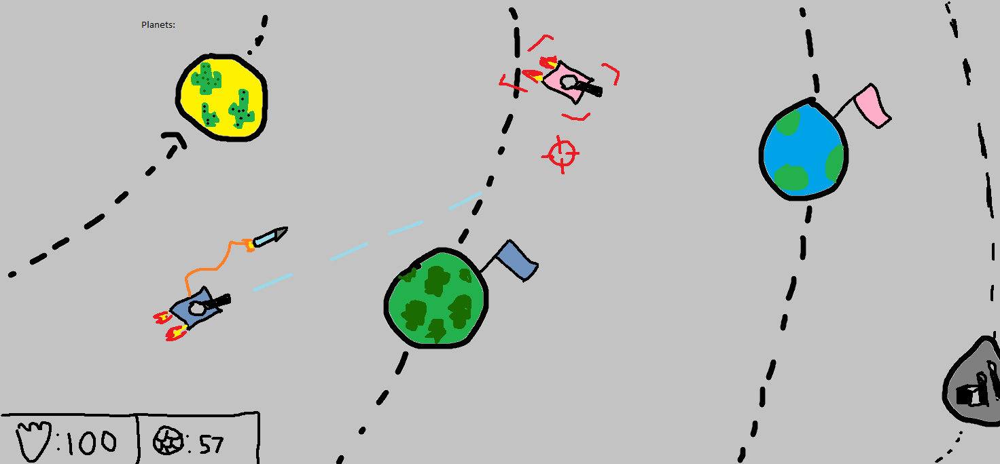

# tankagons.io
a game worked on by me and masea3439

Tasks completed:

-Multiplayer support
-basic body sprites
-player disconnecting
-player centered movement
-shooting
-mouse tracking
-login page
-hitboxes(bullet to tank)

TODO in terms of priority:

-minimap - mathieu
-bullet to tree collision and refine hitbox (bullet shooting out the side) - mathieu

-physics engine for collisions
-art (alphabet and icons)

Backlog:

-minimap
-better art (trees + more tanks)
-hitboxes(tank to tank and tank to tree and bullet to tree etc)
-physics engine
-classes
-enemy's + AI
-more weapon types (missles with pathfinding)

Spawn into a procedurely generated map and fight other players for domination. Protect your spawnpoint while destroying those of your enemies. Farm mobs to increase in strength. 

In game footage:

Outdated Proof of concept:

Expected release date: unknown

